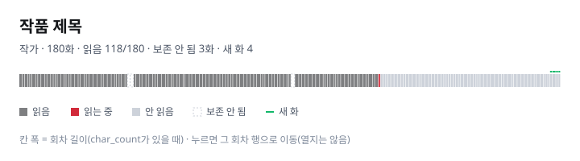
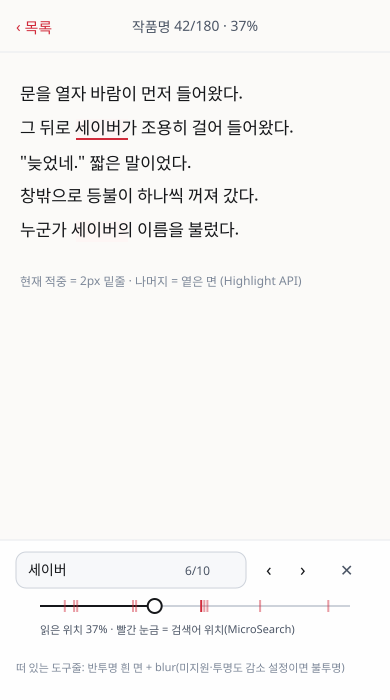
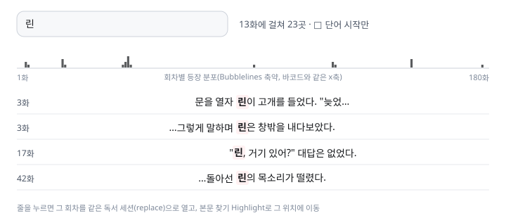

# Reader 고도화 리서치 종합 — 결정 레지스터·디자인 명세·실측

- 상태: 조사·설계 완료, **구현 전**. 이 문서의 어떤 항목도 아직 코드·배포에 반영되지 않았다.
- 작성: 2026-09-30
- 원문: [`21`](21_frontend_enhancement_research.md)(예시 라이브러리 판정·기능 설계, §9 원점 재검토),
  [`22`](22_broad_library_survey.md)(프로젝트 성격에서 출발한 폭넓은 조사)
- 용도: 다른 조사 결과와 **항목 단위로 합칠 수 있게** 21·22의 결론을 ID가 붙은 한 표로 모은다.
  근거·실측 수치는 이 문서 부록에 있다.

## 1. 합치는 방법 (다른 에이전트 조사와 병합할 때)

1. 항목은 `R-<분야>-<번호>` ID로 식별한다. 같은 대상을 다룬 외부 항목은 같은 ID 행에 `출처` 열을 추가해 합친다.
2. 판정이 충돌하면 아래 순서로 정한다.
   1. **실측 > 문서 인용 > 추정.** 이 문서의 `실측` 표시는 이 저장소 파일과 npm 패키지로 직접 잰 값이다(부록 C 재현 명령).
   2. 기능 제약(§2) 위반 여부. 취향 문제는 사용자 결정으로 남긴다.
   3. 되돌리기 쉬운 쪽(설정 옵션, vendoring 한 파일)을 우선한다.
3. 판정 어휘: `adopt`(채택) · `conditional`(조건 충족 시) · `experiment`(실험 후 결정) · `idea-only`(코드 없이 아이디어만) · `reject`(거절).
4. 우선순위: `P1` 이미 드러난 문제를 싸게 해결 · `P2` 경험 확장 · `P3` 결정·비용이 큰 실험.

## 2. 전제 (21 §9에서 확정)

유지하는 제약(기능·보안 이유):

- 외부 CDN에서 script·font를 불러오지 않는다. 외부 코드는 저장소에 vendoring하고 notice를 남긴다.
- AA 격자 보존: 본문 DOM에 요소를 끼우거나 AA 글꼴·자간을 바꾸지 않는다.
- 읽기 위치(`scrollTop` 복원), AA 가로 scroll, pinch, Android Back 계약(`19`).
- WCAG 2.2 AA 대비, 색만으로 상태를 전달하지 않기, reduced-motion 존중.

풀어도 되는 것(과거 취향·당시 규모 판단): framework 금지(ADR-010 재검토 조건 근접), glass·gradient 금지, 서체 3종 제한.
`DESIGN.md` 개정안은 `21 §9.6`.

## 3. 결정 레지스터

비용: S(하루 이하) · M(2~4일) · L(1주 이상). 크기는 min+gzip 실측(부록 A).

### 3.1 한국어 처리 (KO)

| ID | 항목 | 판정 | 우선 | 비용 | 크기 | 근거·메모 |
|---|---|---|---|---|---|---|
| R-KO-01 | es-hangul: 초성 검색·조사·자모 분해 | adopt | P1 | S | 2.7KB | MIT. 작품·게시판·작가 초성 검색, `app.js` `subjectParticle()` 대체 |
| R-KO-02 | CSS `text-autospace` (본문) | adopt | P1 | S | 0 | 2025 Baseline. 설정 on/off |
| R-KO-03 | `Intl.Segmenter('ko')` | adopt | P2 | S | 0 | KWIC 문맥, 문장 anchor, 낭독 문장 단위 |
| R-KO-04 | kiwipiepy 등장인물·용어 색인(Oracle) | adopt | P2 | M | 서버 | 작품별 명사 빈도 → 분포 띠·검색 토큰 |
| R-KO-05 | soynlp | conditional | P3 | M | 서버 | Kiwi가 신조어·인물명을 놓칠 때 |
| R-KO-06 | kiwi-nlp(WASM)·MeCab-ko·Kuromoji·BudouX | reject | — | — | 5.6MB+ | 브라우저에 과대하거나 한국어 미지원 |

### 3.2 AA (AA)

| ID | 항목 | 판정 | 우선 | 비용 | 크기 | 근거·메모 |
|---|---|---|---|---|---|---|
| R-AA-01 | Saitamaar TTF → WOFF2 | adopt | P1 | S | 2.0MB→407KB | 실측 −80%. AA screenshot/DOM 대조 재통과 조건 |
| R-AA-02 | 굴림(OFL) 한글 전용 fallback (`unicode-range`) | experiment | P1 | S | 126KB | 실측: Saitamaar 한글 0자, 굴림 한글 1.0em. 실제 한글 대사 AA 20건 비교 후 결정 |
| R-AA-03 | 기기별 AA 한글 폭 수집(`measureText("가")`) | adopt | P1 | S | 0 | R-QA-01 RUM에 한 필드로. R-AA-02 판단 근거 |
| R-AA-04 | Textar·모나 폰트 선택지 | conditional | P3 | S | — | Saitamaar로 깨지는 AA가 보고될 때. Textar는 IPA 글꼴 라이선스 |
| R-AA-05 | AA를 PNG로 저장 (modern-screenshot) | adopt | P2 | S | 9.6KB | 원 배경·색 그대로 공유 |
| R-AA-06 | `canvas.measureText`로 정확한 `맞춤` 배율 | adopt | P2 | S | 0 | 글꼴 로드 후 계산 |
| R-AA-07 | string-width | reject | — | — | — | 터미널 셀 폭, 비례폭 AA와 불일치 |

### 3.3 검색 (SR)

| ID | 항목 | 판정 | 우선 | 비용 | 크기 | 근거·메모 |
|---|---|---|---|---|---|---|
| R-SR-01 | 메타데이터 substring 검색 유지 | adopt | — | 0 | — | 330,760행 NFKC 스캔은 한국어 부분 일치에 정확 |
| R-SR-02 | 본문 찾기 + CSS Custom Highlight | adopt | P1 | M | 0 | DOM 불변 → AA 안전. §4.2 디자인 |
| R-SR-03 | 작품 안 찾기: MiniSearch vs FlexSearch | experiment | P2 | M | 5.9KB / 17.2KB | bigram tokenizer로 벤치 후 하나 |
| R-SR-04 | 전체 본문: Pagefind | experiment | P3 | L | 런타임 소형 | 한국어 bigram 전처리·색인 크기 실측 필요 |
| R-SR-05 | 전체 본문: SQLite FTS5(trigram) + HTTP range VFS | experiment | P3 | L | ~수백KB WASM | 서버 없이 SQL 전문 검색. `scripts/profile_text_fts.py` 연계 |
| R-SR-06 | 의미 검색: Workers AI bge-m3 + Vectorize | conditional | P3 | L | 서버 | 본문을 Cloudflare AI로 보내는 결정 필요 |
| R-SR-07 | Fuse.js (작은 집합 한정) | conditional | P3 | S | 9.5KB | es-hangul 초성 매칭으로 대부분 해결되면 불필요 |
| R-SR-08 | D1 FTS5 | reject | — | — | — | D1은 control plane 전용 계약 |

### 3.4 읽기 경험 (RD)

| ID | 항목 | 판정 | 우선 | 비용 | 크기 | 근거·메모 |
|---|---|---|---|---|---|---|
| R-RD-01 | 회차 바코드 (Novel Barcode) | adopt | P1 | M | 자체 SVG | §4.1 디자인 |
| R-RD-02 | 비활성 `다음 편` 중립색 등 즉시 수정 U1–U5 | adopt | P1 | S | 0 | `21 §2` screenshot 근거 |
| R-RD-03 | 작품 안 KWIC + 분포 띠 | adopt | P2 | L | 자체 | §4.3 디자인 |
| R-RD-04 | 듣기 모드: Web Speech + Media Session | adopt | P2 | M | 0 | Android 한국어 음성 품질 실기기 확인 |
| R-RD-05 | EPUB 내보내기 (Oracle, ebooklib/pandoc) | adopt | P2 | M | 서버 | 개인 보존·다른 기기 열람 |
| R-RD-06 | 인용 메모·하이라이트 (Floating UI) | adopt | P3 | L | 6.4KB | user-state schema 확장 필요 |
| R-RD-07 | 책 모드: foliate-js paginator | experiment | P3 | L | — | MIT. 위치는 `text-anchor` 문자 offset으로 통일 |
| R-RD-08 | Vivliostyle | reject(runtime) | — | — | 4.8MB | AGPL, 과대. foliate-js로 대체 |
| R-RD-09 | 본문 서체 추가(바탕·고운바탕, OFL) | conditional | P3 | S | — | 사용자 취향 결정 |
| R-RD-10 | Lenis | reject | — | — | — | 위치 복원·AA scroll·Back 충돌 |

### 3.5 이미지·미디어 (MD)

| ID | 항목 | 판정 | 우선 | 비용 | 크기 | 근거·메모 |
|---|---|---|---|---|---|---|
| R-MD-01 | PhotoSwipe v5로 이미지 보기 교체 | adopt | P1 | M | 20.6KB | pinch·swipe·Back. 현재 자체 viewer 대체 |
| R-MD-02 | thumbhash 미리보기 (media_importer 생성) | adopt | P2 | S | 2.0KB | 보관 이미지 로딩 체감 |
| R-MD-03 | @use-gesture/vanilla (AA pinch) | conditional | P3 | S | 8.2KB | 현재 `touchDistance` 수작업이 부족할 때 |

### 3.6 저장·오프라인·동기화 (ST)

| ID | 항목 | 판정 | 우선 | 비용 | 크기 | 근거·메모 |
|---|---|---|---|---|---|---|
| R-ST-01 | 읽기 기록·책장·메모를 IndexedDB로 (idb-keyval) | adopt | P1 | M | 0.7KB | 최근 커밋 83f0dce의 localStorage 한도 문제. §5.3 설계 |
| R-ST-02 | `navigator.storage.persist()` | adopt | P1 | S | 0 | 저장소 자동 삭제 방지 요청 |
| R-ST-03 | Worker+D1 기기 간 동기화(LWW per-key) | adopt | P2 | L | 0 | v3 병합 규칙 재사용. `00`/`08` 계약 개정 필요 |
| R-ST-04 | 작품 단위 오프라인 저장(Service Worker) | conditional | P2 | L | 0 | `09 §6` 조건 그대로 |
| R-ST-05 | Yjs/Automerge | reject | — | — | — | 1인 사용에 과함 |

### 3.7 UI 기반·모션 (UI)

| ID | 항목 | 판정 | 우선 | 비용 | 크기 | 근거·메모 |
|---|---|---|---|---|---|---|
| R-UI-01 | `content-visibility: auto` 긴 목록·댓글 | adopt | P1 | S | 0 | 가상화 대신. anchor 복원·찾기 유지 |
| R-UI-02 | View Transitions (same-document) | adopt | P2 | S | 0 | reduced-motion이면 끔 |
| R-UI-03 | scroll-driven 진행선 | adopt | P1 | S | 0 | 미지원 시 현행 JS |
| R-UI-04 | AutoAnimate | adopt | P2 | S | 3.1KB | 책장·chip·저장함 |
| R-UI-05 | Motion (`motion/mini`) | adopt | P2 | S | 3.9KB | 전체 진입점은 22.8KB라 필요한 것만 |
| R-UI-06 | Floating UI | adopt | P3 | S | 6.4KB | R-RD-06과 함께 |
| R-UI-07 | glass: 떠 있는 chrome에만 | adopt | P2 | S | 0 | `prefers-reduced-transparency` fallback |
| R-UI-08 | 기능적 gradient(fade mask) | adopt | P2 | S | 0 | 잘린 목록·AA 가장자리 |
| R-UI-09 | 명령 팔레트(⌘K) 자체 구현 + es-hangul | adopt | P2 | M | 0 | 데스크톱 |
| R-UI-10 | `app.js` 모듈 분할 | adopt | P2 | L | 0 | 4,571줄. E2E 324건이 안전망 |
| R-UI-11 | Lit (필요 시 컴포넌트화) | conditional | P3 | L | 6.0KB | framework 전면 도입의 가벼운 대안 |
| R-UI-12 | 빌드 단계(esbuild minify) | conditional | P2 | M | −35% JS | 실측: app.js gzip 51.8→33.4KB. 라이브러리 3개 이상이면 |
| R-UI-13 | Magic UI·Aceternity·Animate UI | idea-only | — | — | — | Tracing Beam·Timeline·Number Ticker만 vanilla 이식 |
| R-UI-14 | React/Tailwind 전면 전환, React Virtuoso | reject | — | — | — | `21 §9.3` |
| R-UI-15 | Rough.js / Rough Notation | reject / conditional | P3 | S | — | Notation만 하이라이트 스타일 옵션으로 |
| R-UI-16 | SUIT 드문 음절 fallback 보강 | experiment | P3 | S | — | 실측: SUIT 한글 2,668자. 제목에 빠진 음절 빈도 조사 후 |

### 3.8 시각화·분석 (VZ)

| ID | 항목 | 판정 | 우선 | 비용 | 크기 | 근거·메모 |
|---|---|---|---|---|---|---|
| R-VZ-01 | 독서 캘린더 heatmap (자체 SVG) | adopt | P2 | S | 0 | 개인 읽기 기록 |
| R-VZ-02 | uPlot (`/ops` 시계열) | adopt | P2 | S | 23KB | `/ops`에서만 로드 |
| R-VZ-03 | 게시판 연대기(small multiples) | conditional | P3 | M | 0 | `21 §4.6` |
| R-VZ-04 | Observable Plot, DuckDB-WASM | experiment | P3 | L | 수 MB | 별도 통계 페이지에서만 |
| R-VZ-05 | Datasette (로컬 SQLite 탐색) | adopt | P2 | S | 로컬 | 배포 없음 |
| R-VZ-06 | Voyant WordTree·Links·Knots·Mandala·TextualArc·Correlations | reject | — | — | — | 한국어 조사 문제·모바일 판독성 |

### 3.9 품질·관측 (QA)

| ID | 항목 | 판정 | 우선 | 비용 | 크기 | 근거·메모 |
|---|---|---|---|---|---|---|
| R-QA-01 | web-vitals RUM → Worker → 저장 | adopt | P1 | M | 3.3KB | "실제 Android acceptance" 증거 자동 수집. §5.2 설계 |
| R-QA-02 | Biome lint/format | adopt | P1 | S | dev | Python의 Ruff에 해당 |
| R-QA-03 | `checkJs` + JSDoc 타입 | adopt | P2 | M | dev | 빌드 없이 타입 검사 |
| R-QA-04 | Playwright `toHaveScreenshot` | adopt | P1 | S | dev | 이미 찍는 4개 폭 screenshot을 회귀 테스트로 |

### 3.10 보존·개정·운영·AI (AR)

| ID | 항목 | 판정 | 우선 | 비용 | 크기 | 근거·메모 |
|---|---|---|---|---|---|---|
| R-AR-01 | 개정 비교 화면 (jsdiff) | adopt | P2 | M | 2.5KB | `text_archive_revisions`, `source_variants` |
| R-AR-02 | ReplayWeb.page WARC 재생 | conditional | P3 | L | — | `09 §6` 유지 |
| R-AR-03 | cronstrue | reject | — | — | 34KB | 실측 과대. 20줄 formatter |
| R-AR-04 | xterm.js / ansi_up | reject / conditional | — | — | — | structured step 원칙 |
| R-AR-05 | AI "지난 이야기" 요약 | conditional | P3 | L | 서버 | 본문을 외부 API로 보내는 결정 필요 |

## 4. 디자인 명세

### 4.1 회차 바코드 (R-RD-01)



- 1회차 = 1칸. 칸 폭은 `char_count`가 있으면 길이 비례(최소 1px), 없으면 균등.
- 색: 읽음 `--ink` 55% · 읽는 중 `--accent`(작품당 한 칸) · 안 읽음 `--line-strong` · 보존 안 됨 점선 빈칸 · 새 화 `--success` 2px 윗선.
- 범례와 요약 문장을 항상 함께 둔다(`aria-label` 동일 문장). 키보드 탐색은 목록·`회차로 이동`이 맡는다.
- 누르면 해당 회차 행으로 scroll만 한다(열지 않음). Home `읽던 작품` 행에는 높이 4px 미니 버전.

### 4.2 본문 찾기 + 위치 막대 (R-SR-02)



- 진입: 더보기 `본문에서 찾기`, 데스크톱 단축키 `g`(기존 `/`·`[`·`]`·`b`·`f`·`?`와 겹치지 않음). Ctrl/⌘+F는 브라우저 몫.
- 표시: `CSS.highlights` 두 개. 전체 적중 `redstm-find`(accent-soft 면), 현재 적중 `redstm-find-current`(2px accent 밑줄).
- 위치 막대: `읽은 위치` 슬라이더 위 적중 눈금. 현재 적중 눈금만 불투명.
- 하단 도구는 떠 있는 층이므로 반투명 + blur(R-UI-07), 미지원·투명도 감소 설정이면 불투명.
- Highlight API가 없으면 개수·이동만 제공하고 `<mark>`로 대체하지 않는다(AA 보호).

### 4.3 작품 안 찾기 KWIC (R-RD-03)



- 상단: 입력 + `N화에 걸쳐 M곳` + `단어 시작만` 토글(`Intl.Segmenter` 단어 경계).
- 분포 띠: 바코드와 같은 x축, 회차별 적중 수 = 막대 높이.
- 줄: `회차 | 왼쪽 문맥(오른쪽 정렬) | 검색어 | 오른쪽 문맥`. 누르면 그 회차를 같은 독서 세션(replace)으로 열고 R-SR-02로 이동.
- 데이터: 먼저 Worker가 회차 본문을 받아 즉석 색인(동시 4, 취소 가능, 20MB 초과·데이터 절약 모드면 확인). 느리면 publisher 색인(R-SR-03).

### 4.4 AA 한글 fallback (R-AA-02 실험 설계)

```css
@font-face { font-family: "AA Hangul"; src: url("/fonts/Gulim-Hangul.woff2") format("woff2");
             unicode-range: U+1100-11FF, U+3130-318F, U+AC00-D7A3; font-display: swap; }
.archive-body.aa { font-family: Saitamaar, "AA Hangul", Stmr, "MS PGothic", …; }
```

- Saitamaar에 한글이 없으므로 한글만 굴림으로 가고 일본어·기호·공백 격자는 그대로다.
- 비교 대상: 현행(기기 기본) / 굴림 / 돋움 / 맑은 고딕. 한글 대사가 있는 실제 AA 20건을 1440px·390px에서 screenshot.
- 채택 조건: 원작 캡처(가능하면 원 게시물의 Windows 화면)와 가장 가깝고, 한글이 없는 AA의 DOM·screenshot은 바이트 동일.

## 5. 아키텍처 설계

### 5.1 vendoring 정책

- 위치: `edge/public/vendor/<name>@<version>/<entry>.js`(번들된 ESM 한 파일) + `LICENSE`.
- 생성: `edge/scripts/vendor.mjs`가 고정 버전을 esbuild로 한 번 번들하고 SHA-256을 기록. 런타임 빌드 단계는 만들지 않는다.
- 등록: `THIRD_PARTY_NOTICES.md`(버전·SHA·라이선스), `package.json` `check`의 `node --check`, `scripts/check-assets.mjs`.
- 예산: Reader 첫 로드에 더하는 외부 JS는 min+gzip 합계 **15KB 이하**(R-KO-01, R-QA-01, R-ST-01, R-UI-04, R-UI-05 합계 약 13.7KB). 나머지는 기능을 열 때 동적 `import()`.

### 5.2 RUM (R-QA-01, R-AA-03)

- Reader: `web-vitals`의 LCP·INP·CLS + `search-index-ms`(색인 로드 시간) + `aa-hangul-em`(`measureText("가")/fontSize`) + `deviceMemory`·화면 폭·저장소 사용량. `visibilitychange: hidden`에서 `navigator.sendBeacon`.
- Worker: `POST /api/v1/rum`, Access 사용자만, 64개 필드 이하·1KB 이하로 검증.
- 저장: Workers Analytics Engine(권장, control plane과 분리) 또는 D1 새 표(보존 30일). 선택은 사용자 결정.
- `/ops`: 기기별 p75 표 하나.

### 5.3 IndexedDB 이전 (R-ST-01)

- 저장소: DB `redstm`, store `state`(key = `typemoon.v2`, `text.v1`, `shelves`, `annotations`).
- 이전: 첫 실행 시 localStorage 사본을 읽어 IndexedDB에 쓰고, 성공을 확인한 뒤에만 localStorage 본문을 지운다(설정 키는 유지).
- cross-tab: `storage` event 대신 `BroadcastChannel("redstm-state")`로 저장 사실을 알린다.
- 내보내기·가져오기 v3 파일 형식은 바꾸지 않는다.

## 6. 권장 실행 순서

| 단계 | 묶음 | 완료 기준 |
|---|---|---|
| 1 | R-QA-01 RUM, R-AA-03 | 실제 Android 1대 이상 수치가 `/ops`에 보임 |
| 2 | R-RD-02(U1–U5), R-UI-01, R-UI-03, R-AA-01, R-QA-02, R-QA-04 | 기존 E2E 324건·axe 통과, screenshot 회귀 기준선 |
| 3 | R-AA-02 실험 | 비교 screenshot 표와 결정 기록 |
| 4 | R-SR-02 본문 찾기, R-RD-01 바코드, R-KO-01, R-KO-02 | §4 명세대로, AA DOM 불변 테스트 |
| 5 | R-ST-01, R-ST-02, R-MD-01 | 이전 전후 상태 동일성 테스트, 이미지 보기 E2E |
| 6 | P2 묶음 | 항목별 |

## 부록 A. 실측 크기

esbuild 0.x `--bundle --minify --format=esm`, gzip -9. 2026-09-30 npm 최신판.

| 패키지 | 버전 | 라이선스 | 측정한 진입점 | min | gzip |
|---|---|---|---|---:|---:|
| es-hangul | 2.4.0 | MIT | getChoseong, josa, disassemble, assemble | 6,854 | 2,691 |
| photoswipe | 5.4.4 | MIT | lightbox + core | 75,130 | 20,630 |
| idb-keyval | 6.3.0 | Apache-2.0 | 전체 | 1,957 | 748 |
| web-vitals | 6.2.2 | Apache-2.0 | onLCP, onINP, onCLS, onTTFB, onFCP | 8,644 | 3,280 |
| minisearch | 7.2.0 | MIT | default | 17,660 | 5,926 |
| flexsearch | 0.8.212 | Apache-2.0 | Document, Index | 50,544 | 17,210 |
| fuse.js | 7.5.0 | Apache-2.0 | default | 26,530 | 9,488 |
| motion | 13.4.6 | MIT | `motion/mini` animate | 9,748 | 3,906 |
| motion | 13.4.6 | MIT | animate, scroll, inView | 62,056 | 22,811 |
| @formkit/auto-animate | 0.10.0 | MIT | default | 7,858 | 3,141 |
| @floating-ui/dom | 1.8.0 | MIT | computePosition, autoUpdate, flip, shift, offset | 15,842 | 6,447 |
| modern-screenshot | 4.7.0 | MIT | domToPng | 24,121 | 9,591 |
| thumbhash | 0.1.1 | MIT | 전체 | 3,709 | 1,993 |
| diff | 9.0.0 | BSD-3-Clause | diffChars, diffWordsWithSpace | 6,442 | 2,493 |
| uplot | 1.6.32 | MIT | default | 52,000 | 22,999 |
| @use-gesture/vanilla | 10.3.1 | MIT | Pinch, Drag | 26,448 | 8,236 |
| lit | 3.3.3 | BSD-3-Clause | LitElement, html, css | 15,468 | 5,979 |
| cronstrue | 3.27.0 | MIT | i18n | 232,020 | 34,468 |

라이선스만 확인한 것: foliate-js 1.0.1 MIT · pagefind 1.5.2 MIT · sql.js-httpvfs 0.8.12 Apache-2.0 · kiwi-nlp 0.24.0 Apache-2.0(unpacked 5.6MB) ·
@tanstack/virtual-core 3.17.11 MIT · rough-notation 0.5.1 MIT · lenis 1.3.26 MIT · @vivliostyle/core 2.45.2 **AGPL-3.0**(unpacked 4.8MB) ·
@biomejs/biome 2.5.14 MIT/Apache-2.0 · ansi_up 6.0.6 MIT.

## 부록 B. 현재 payload 기준선 (2026-09-30 `main` bb857c3)

| 파일 | raw | gzip-9 | minify 후 gzip |
|---|---:|---:|---:|
| `app.js` | 202,984 | 51,829 | 33,384 |
| `text-library.js` | 86,227 | 22,735 | 15,047 |
| `app.css` | 71,769 | 13,305 | — |
| `index.html` | 44,967 | 9,256 | — |
| `SUIT-Variable.woff2` | 624,536 | — | 한글 2,668자 |
| `MaruBuri-Regular.woff2` | 433,776 | — | 한글 11,172자, 가나·한자 0 |
| `Saitamaar-Regular.ttf` | 2,015,748 | 592,399 | WOFF2 407,204 |
| 굴림 한글 전용 WOFF2(후보) | — | — | 125,588 |

글꼴 metric(fontTools):

| 글꼴 | upm | 반각 공백 | 전각 공백 | `A` | `あ` | 한글 |
|---|---:|---:|---:|---:|---:|---|
| Saitamaar | 1280 | 0.3125em | 0.6875em | 0.625em | 0.9375em | 없음 |
| Gulim (OFL) | 1024 | 0.333em | 1.0em | 0.646em | 1.0em | 11,172자, 모두 1.0em |
| GulimChe (OFL) | 1024 | 0.5em | 1.0em | 0.5em | 1.0em | 11,172자, 모두 1.0em |
| Dotum (OFL) | 1024 | 0.334em | 1.0em | 0.667em | 1.0em | 11,172자, 모두 1.0em |

## 부록 C. 재현 명령

```bash
# 후보 패키지 크기
npm i esbuild es-hangul photoswipe idb-keyval web-vitals minisearch flexsearch fuse.js motion \
  @formkit/auto-animate @floating-ui/dom modern-screenshot thumbhash diff uplot @use-gesture/vanilla lit cronstrue
echo 'export {getChoseong,josa,disassemble,assemble} from "es-hangul"' > e.mjs
npx esbuild e.mjs --bundle --minify --format=esm | gzip -9 | wc -c

# 글꼴 cmap/metric, WOFF2 크기
python -c "from fontTools.ttLib import TTFont; f=TTFont('edge/public/fonts/Saitamaar-Regular.ttf'); \
print(sum(1 for c in f.getBestCmap() if 0xAC00<=c<=0xD7A3))"
git clone --depth 1 https://github.com/googlefonts/gulim   # fonts/ttf/hinted/*.ttf, OFL.txt

# 화면 fixture (로컬 Chromium)
cd edge && npm ci && npx playwright test e2e/viewer.spec.js e2e/ops.spec.js   # .wrangler/screenshots/
```

## 부록 D. 아직 확인하지 못한 것

| 항목 | 이유 | 확인 방법 |
|---|---|---|
| 실제 기기 기본 한국어 글꼴의 한글 advance(맑은 고딕, Apple SD Gothic Neo, Android 기본) | container에 해당 글꼴 없음 | R-AA-03 RUM |
| 한글 대사 AA 실제 샘플 비교 | production 데이터가 이 환경에 없음 | R-AA-02 실험 |
| Pagefind·FTS5 색인 크기 | 전체 본문 데이터 필요 | Oracle에서 `profile_text_fts.py` 확장 |
| Android Web Speech 한국어 음성 품질 | 실기기 필요 | R-RD-04 시험 |
| SUIT에 없는 음절이 실제 제목에 나오는 빈도 | search index 필요 | index 제목 전체 cmap 대조 스크립트 |
